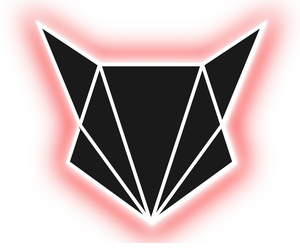

# Hi, I'm f0xcap, welcome to my github page

**Stuff you might find here (in the future)**
- random discord bots written in python
- simple shell script I use to automate stuff
- dotfiles and config files
- random malware I deobfuscte
- other random projects I might decide to publish

My current job position is *cloud system engineer*. I spend most of my free
time surfing the many services of interwebs, (mainly ircs) learning about 
security and privacy. I like to solve CTF challenges on TryHackMe or HackTheBox 
(took a break recently cuz of new job). 

I like to spread the word about privacy and security.
I despise big corporations and social media for the data collection and enabling 
adversaries to spy on the regular folk, creating an illusion of democracy.

Check out my crude [website](https://foxcap.sk).

*==Hack the planet!*== 
